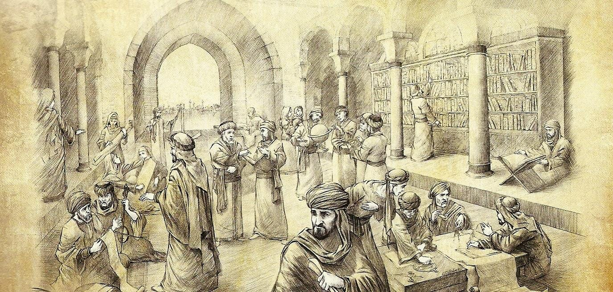
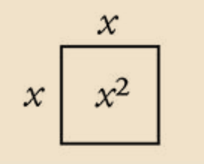
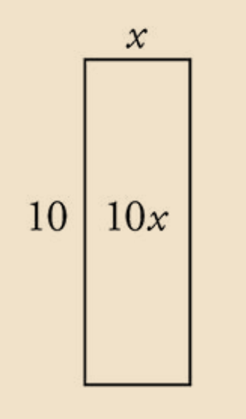
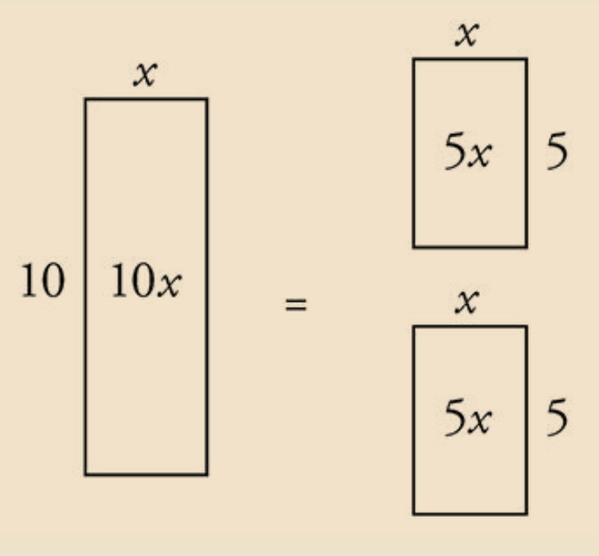
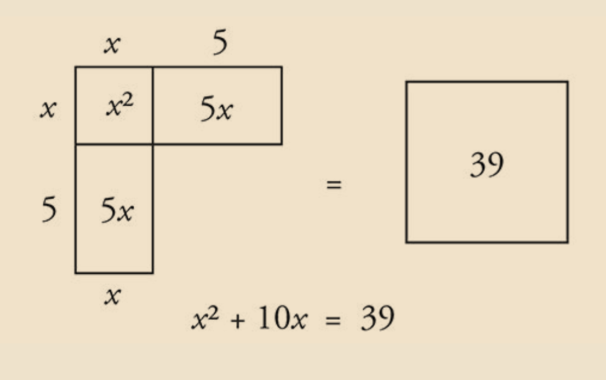
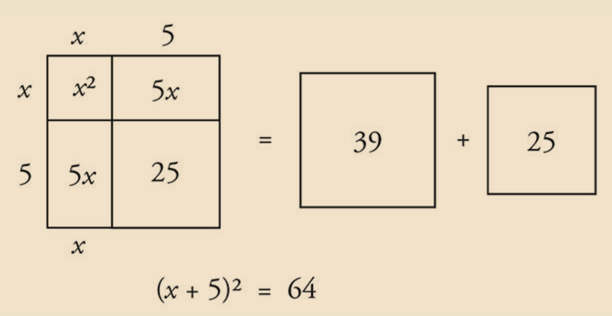
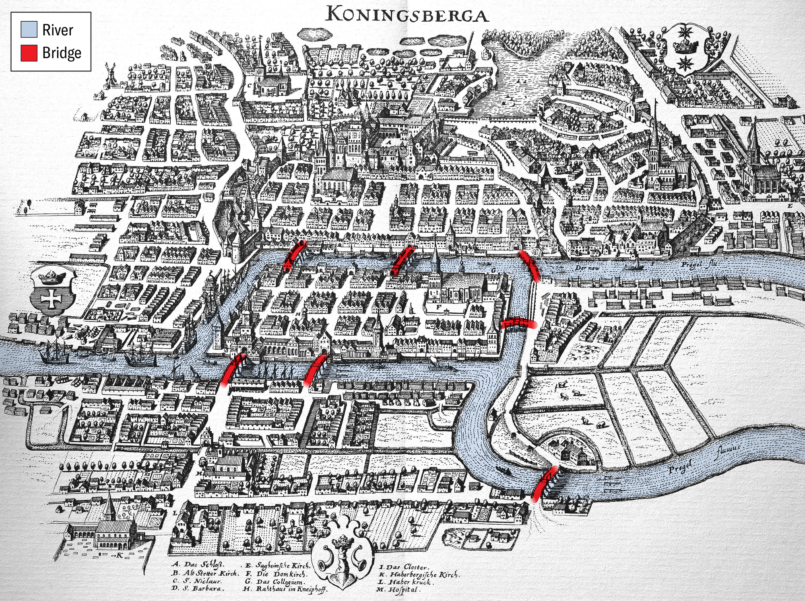
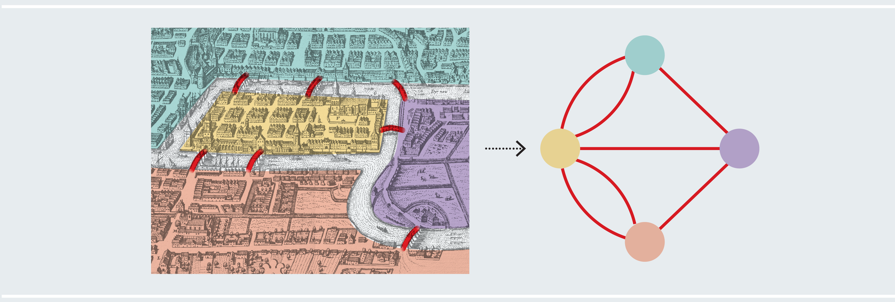
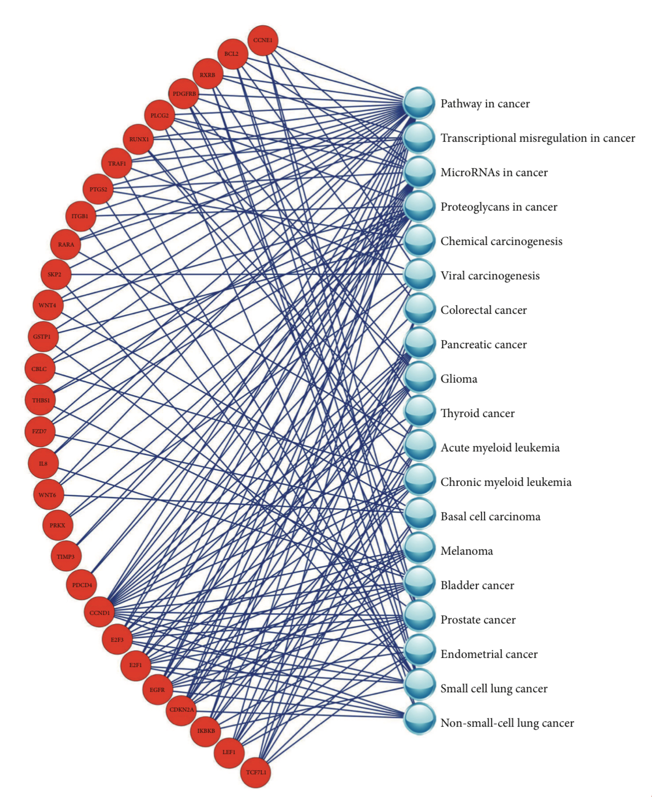

# History's lectures

## قسمت دوم: مردی که جبر را اختراع کرد

<iframe style="border-radius: 12px" width="100%" height="152" title="Spotify Embed: قسمت دوم: مردی که جبر را اختراع کرد" frameborder="0" allowfullscreen allow="autoplay; clipboard-write; encrypted-media; fullscreen; picture-in-picture" loading="lazy" src="https://open.spotify.com/embed/episode/4CrdlLG4mfTawIZ4Wlg3yX?utm_source=generator"></iframe>

  
  
  
  
  
  

## قسمت اول: پل های کونیگسبرگ

<iframe style="border-radius: 12px" width="100%" height="152" title="Spotify Embed: قسمت اول: پل های کونیگسبرگ" frameborder="0" allowfullscreen allow="autoplay; clipboard-write; encrypted-media; fullscreen; picture-in-picture" loading="lazy" src="https://open.spotify.com/embed/episode/2S8FrkaSzwqOOYyW8VHdmz?utm_source=generator"></iframe>

  
  
  

## قسمت صفر: معرفی

<iframe style="border-radius: 12px" width="100%" height="152" title="Spotify Embed: قسمت صفر: معرفی" frameborder="0" allowfullscreen allow="autoplay; clipboard-write; encrypted-media; fullscreen; picture-in-picture" loading="lazy" src="https://open.spotify.com/embed/episode/6dSn48EwdPplH83EljY9gR?utm_source=generator"></iframe>
